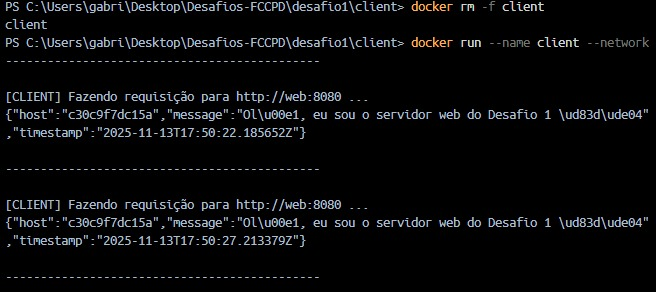

# Desafio 1 — Containers em Rede

## Objetivo

Este desafio tem como objetivo criar **dois containers Docker** que se comunicam entre si por meio de uma **rede Docker customizada**.  
A ideia é mostrar, na prática, como:

- criar uma rede Docker nomeada;
- conectar múltiplos containers nessa rede;
- expor uma porta para o host;
- fazer um container “client” consumir um serviço HTTP de outro container.


## Visão Geral da Solução

A solução é composta por dois containers:

- **Servidor web (`web`)**  
  - Implementado em **Python + Flask**.  
  - Responde na porta **8080** com um JSON contendo uma mensagem, timestamp e o hostname do container.  
  - Imagem baseada em `python:3.12-slim`.

- **Cliente (`client`)**  
  - Implementado em **shell script** rodando em um container baseado em `alpine`.  
  - Utiliza `curl` em loop infinito para fazer requisições HTTP periódicas para o servidor.  
  - A cada ~5 segundos faz uma requisição para `http://web:8080` e exibe a resposta no terminal.

Ambos os containers estão conectados na mesma **rede Docker customizada** chamada `desafio1-net`, o que permite que o client acesse o servidor pelo hostname `web`.


## Arquitetura e Fluxo

### Componentes

- **Rede Docker**
  - Nome: `desafio1-net`
  - Tipo: bridge (rede interna criada pelo Docker)
  - Função: permitir que os containers `web` e `client` se enxerguem pelo nome.

- **Container `web`**
  - Imagem: `desafio1-web`
  - Porta exposta no container: `8080`
  - Porta mapeada no host: `8080` → `8080`
  - Endpoint principal: `GET /`
  - Resposta (exemplo):

    ```json
    {
      "message": "Olá, eu sou o servidor web do Desafio 1 😄",
      "timestamp": "2025-11-13T17:47:40.338887Z",
      "host": "c30c9f7dc15a"
    }
    ```

- **Container `client`**
  - Imagem: `desafio1-client`
  - Script de entrada: `request_loop.sh`
  - Comportamento:
    - Imprime uma mensagem de inicialização.
    - Entra em um loop infinito:
      - faz `curl http://web:8080`;
      - imprime o corpo da resposta (JSON);
      - aguarda 5 segundos e repete.

### Diagrama (conceitual)


                +--------------------------+
                |        Host (PC)         |
                |                          |
 Navegador /    |  http://localhost:8080   |
 curl           |          |               |
                |          v               |
                |    [ Porta 8080 ]        |
                +-----------|--------------+
                            |
                 (port mapping host → container)
                            |
                            v
                +--------------------------+
                |      Container "web"     |
                |   Imagem: desafio1-web   |
                |   Flask em 0.0.0.0:8080  |
                +--------------------------+
                            ^
                            |
                 (rede Docker "desafio1-net")
                            |
                            v
                +--------------------------+
                |     Container "client"   |
                | Imagem: desafio1-client  |
                | curl http://web:8080     |
                +--------------------------+


## Estrutura de Pastas do Desafio 1

    Dentro da pasta desafio1/:

    desafio1/
    ├── server/
    │   ├── app.py          # Servidor Flask
    │   └── Dockerfile      # Dockerfile do servidor
    └── client/
        ├── request_loop.sh # Script que chama o servidor em loop
        └── Dockerfile      # Dockerfile do client

## Arquivos principais
    -server/app.py
    -server/Dockerfile
    -client/request_loop.sh
    -client/Dockerfile

## Passo a Passo de execução
    Docker instalado e funcionando

    Terminal (PowerShell / CMD / WSL).

    Todos os comandos abaixo assumem que você está na raiz do repositório

      C:\Users\...> cd C:\Users\...\Desafios-FCCPD

    # Criar uma rede docker

      docker network create desafio1-net
      docker network ls

    # Build de imagens
    1) servidor
        cd server
        docker build -t desafio1-web .
    2) cliente
        cd ../client
        docker build -t desafio1-client .
    
    # Subir o servidor web
        docker run -d --name web --network desafio1-net -p 8080:8080 desafio1-web

    # Verifica se o container esta rodando (Opcional)
        docker ps

    # testar servidor pelo host
        curl http://localhost:8080 | Select-Object -Expand Content

    Esse é o que eu usei pq você so ve o json, se for botar: "curl http://localhost:8080" fica com o terminal poluído

    # Subir o client que faz requisições em loop
        docker run --name client --network desafio1-net desafio1-client

    # Saída esperada
  


