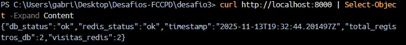
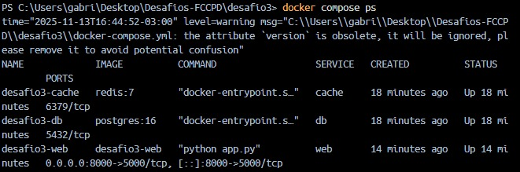

# Desafio 3 — Docker Compose Orquestrando Serviços

## Objetivo

Usar **Docker Compose** para orquestrar uma aplicação composta por **3 serviços**:

- `web`: aplicação Flask que expõe uma API HTTP.
- `db`: banco de dados PostgreSQL.
- `cache`: serviço de cache Redis.

A aplicação web se comunica com o banco e com o cache via rede interna criada pelo Compose.

## Arquitetura

### Serviços

- **web (desafio3-web)**
  - Imagem construída a partir de `web/Dockerfile`.
  - Porta exposta: `5000` (mapeada para `8000` no host).
  - Tecnologias: Python, Flask, psycopg2, Redis.
  - Lê variáveis de ambiente (`DB_HOST`, `DB_USER`, etc.) definidas no `docker-compose.yml`.
  - Funções principais:
    - Cria tabela `visitas` no Postgres (se não existir).
    - Insere um novo registro a cada requisição.
    - Conta quantos registros existem.
    - Incrementa um contador de visitas no Redis (`visitas_home`).

- **db (desafio3-db)**
  - Imagem: `postgres:16`.
  - Variáveis de ambiente:
    - `POSTGRES_USER=usuario`
    - `POSTGRES_PASSWORD=senha123`
    - `POSTGRES_DB=desafio3db`
  - Usa o volume nomeado `db-data` para persistir os dados.
  - Acessado pelo hostname `db` dentro da rede `desafio3-net`.

- **cache (desafio3-cache)**
  - Imagem: `redis:7`.
  - Acessado pelo hostname `cache`.
  - Armazena o contador de visitas em memória.

### Rede e Volumes

- Rede interna: `desafio3-net`
  - Criada automaticamente pelo Compose.
  - Todos os três serviços estão conectados nela.
  - Permite que o `web` acesse `db` e `cache` pelos hostnames.

- Volume: `db-data`
  - Armazena os dados do PostgreSQL.
  - Declarado em `volumes:` no `docker-compose.yml`.

## Estrutura do Projeto

desafio3/
├── docker-compose.yml
└── web/
    ├── Dockerfile
    ├── requirements.txt
    └── app.py

## Passo a passo de execução

    1) Subir serviços
      docker compose up -d --build
    1.1) (Opcional) verificação
      docker compose ps

    2) Acessar aplicação
      curl http://localhost:8000 | Select-Object -Expand Content

    3) Teste de comunicação
      docker compose exec web ping -c 2 db
      docker compose exec web ping -c 2 cache

    #Prints

Prova que o serviço web consegue resolver o hostname db na rede interna e se comunicar com o Postgres.

Prova que o web também fala com o Redis (cache) na mesma rede.

Prova que o endpoint da aplicação está funcionando e que:

    db_status = "ok" → comunicação com o Postgres

    redis_status = "ok" → comunicação com o Redis

    total_registros_db e visitas_redis estão sendo atualizados

isso evidencia o Compose orquestrando os 3 serviços.