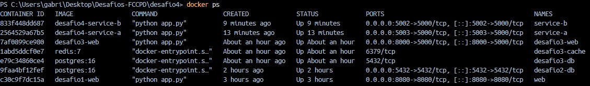
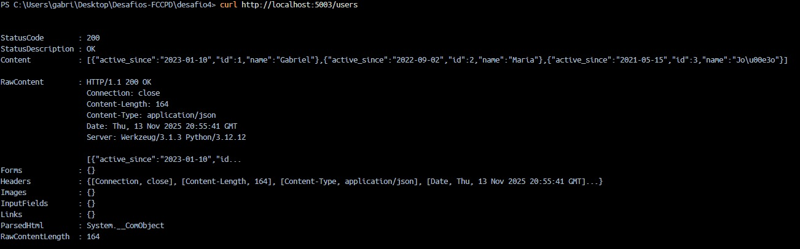
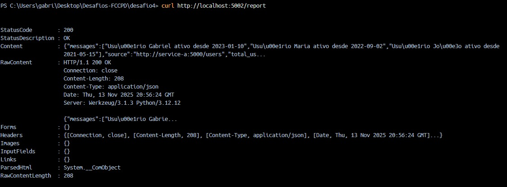

# Desafio 4 — Microsserviços Independentes

## Objetivo

Criar **dois microsserviços independentes** que se comunicam via HTTP:

- **Microsserviço A (service-a)**: expõe uma lista de usuários em JSON.
- **Microsserviço B (service-b)**: consome o serviço A, combina as informações e devolve um “relatório” com frases do tipo  
  `“Usuário X ativo desde Y”`.

Cada microsserviço roda em um **container Docker separado**, com seu próprio Dockerfile, e a comunicação acontece via HTTP usando uma **rede Docker customizada (`desafio4-net`)**.


## Arquitetura da Solução

### Visão Geral

- **service-a**
  - Framework: Flask (Python).
  - Endpoint principal: `GET /users`
  - Retorna uma lista fixa de usuários em JSON, por exemplo:
    ```json
    [
      {"id": 1, "name": "Gabriel", "active_since": "2023-01-10"},
      {"id": 2, "name": "Maria",   "active_since": "2022-09-02"},
      {"id": 3, "name": "João",    "active_since": "2021-05-15"}
    ]
    ```
  - Endpoint de saúde: `GET /health` → `{"status": "ok"}`

- **service-b**
  - Framework: Flask (Python) + `requests`.
  - Endpoint principal: `GET /report`
    - Chama o microsserviço A via HTTP.
    - Lê o JSON de `/users`.
    - Monta frases como:
      ```text
      "Usuário Gabriel ativo desde 2023-01-10"
      ```
    - Retorna um JSON como:
      ```json
      {
        "source": "http://service-a:5000/users",
        "total_users": 3,
        "messages": [
          "Usuário Gabriel ativo desde 2023-01-10",
          "Usuário Maria ativo desde 2022-09-02",
          "Usuário João ativo desde 2021-05-15"
        ]
      }
      ```
  - Endpoint de saúde: `GET /health` → `{"status": "ok"}`
  - A URL do serviço A é configurada via variável de ambiente `USERS_API_URL`.

### Rede Docker

- Rede: **`desafio4-net`**
  - Criada manualmente com `docker network create`.
  - Conecta os containers `service-a` e `service-b`.
  - Dentro da rede, o `service-b` acessa o `service-a` pelo hostname `service-a` na porta `5000`.

### Esquema (conceitual)


               +---------------------------+
               |        Host (PC)         |
               |                           |
 Navegador /   |  http://localhost:5003   --> service-a (/users)
 curl          |  http://localhost:5002   --> service-b (/report)
               +---------------------------+

                 (rede Docker: desafio4-net)
                          |
          +---------------+---------------+
          |                               |
   +-------------+                 +-------------+
   |  service-a  |  <--- HTTP ---  |  service-b  |
   | Flask /users|                 | Flask/report|
   +-------------+                 +-------------+

## Estrutura de Pastas
    desafio4/
├── service-a/
│   ├── app.py
│   ├── requirements.txt
│   └── Dockerfile
├── service-b/
│   ├── app.py
│   ├── requirements.txt
│   └── Dockerfile

## Como executar
    Todos os comandos abaixo são executados a partir da pasta desafio4

    1) Criar a rede Docker
    - docker network create desafio4-net

    2) Build de imagens
    2.1) service-a
        docker build -t desafio4-service-a ./service-a
    2.2) service-b
        docker build -t desafio4-service-b ./service-b

    3) Subir o Microsserviço A
        - docker run -d --name service-a \
            --network desafio4-net \
            -p 5003:5000 \
            desafio4-service-a
    3.2) Subir o Microsserviço B
        - docker run -d --name service-b \
            --network desafio4-net \
            -p 5002:5000 \
            -e USERS_API_URL=http://service-a:5000/users \
            desafio4-service-b
    

# Prints







