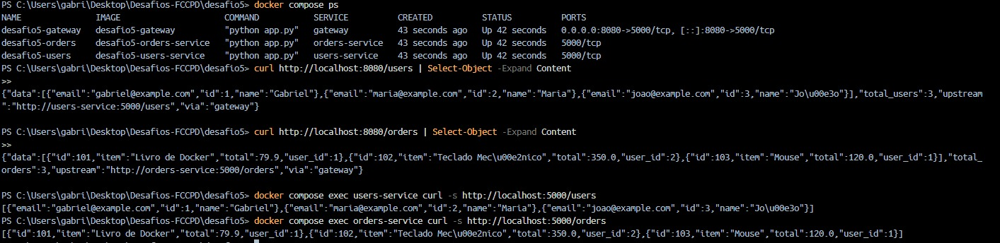

# Desafio 5 — Microsserviços com API Gateway

## Objetivo

Criar uma arquitetura com **API Gateway** centralizando o acesso a dois microsserviços:

- **Users Service**: fornece dados de usuários.
- **Orders Service**: fornece dados de pedidos.
- **Gateway**: expõe os endpoints `/users` e `/orders` e orquestra as chamadas para os dois serviços.

Todos os serviços são executados em containers Docker, orquestrados via `docker-compose`.

## Arquitetura

- `users-service` (porta interna 5000)
  - `GET /users` → lista de usuários em JSON.
- `orders-service` (porta interna 5000)
  - `GET /orders` → lista de pedidos em JSON.
- `gateway` (porta interna 5000, exposta como 8080 no host)
  - `GET /users` → chama `users-service` via HTTP, devolve resposta agregada.
  - `GET /orders` → chama `orders-service` via HTTP.
  - Usa variáveis de ambiente:
    - `USERS_SERVICE_URL`
    - `ORDERS_SERVICE_URL`
  - Ponto único de entrada para o consumidor externo: `http://localhost:8080`.

Rede:

- Rede interna `desafio5-net`, criada pelo Compose.
- Os serviços se enxergam pelos hostnames:
  - `users-service`
  - `orders-service`
  - `gateway`

## ▶️ Como executar
    Para rodar, voce deve estar na pasta do desafio 5

    1) Criar 
      docker compose up -d --build

    2) Mostrar como esta
      docker compose ps
    
    3) Testar users
      curl http://localhost:8080/users | Select-Object -Expand Content
    
    3.1) Testar orders
      curl http://localhost:8080/orders | Select-Object -Expand Content

    3.2) testar users-service
      docker compose exec users-service curl -s http://localhost:5000/users
    
    3.3) Testar orders-service
      docker compose exec orders-service curl -s http://localhost:5000/orders

# Prints

